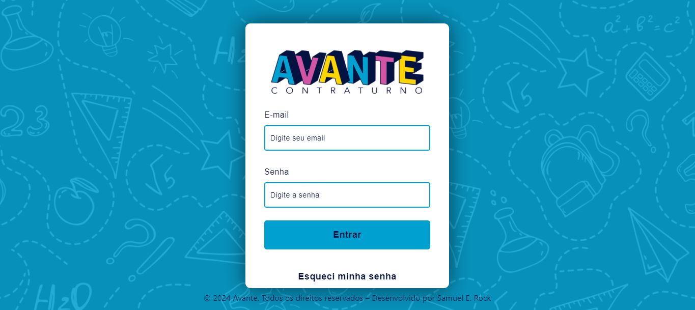
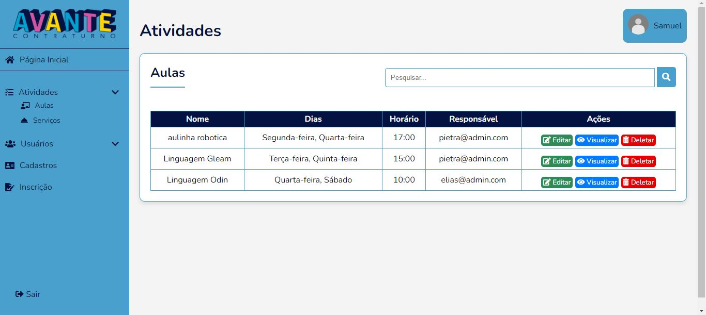
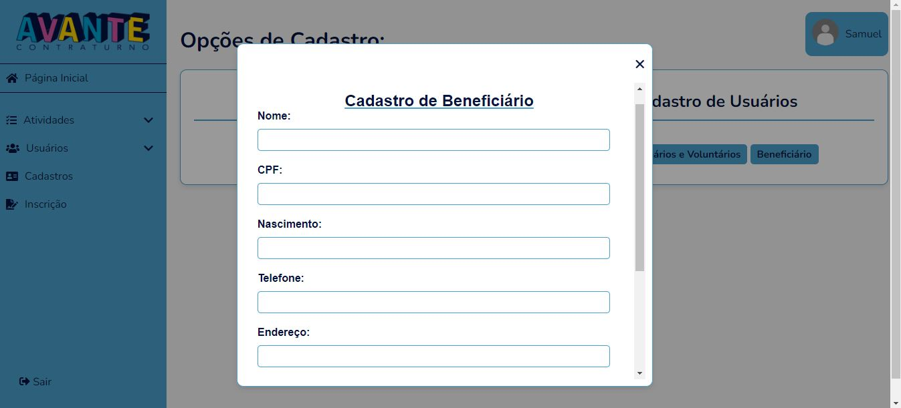

# Introdução 

Esse é um sistema de gerenciamento de atividade, com ele o projeto social avante poderar criar login de acesso, esses login podem criar atividades do tipo Serviços e Aulas, Cadastrar beneficiados do Avante, e increver esses beneficiados em algum serviço ou aula.

## Tela de Login

## Tela de lista de Aulas criadas

## Tela de cadastro de Beneficiados

