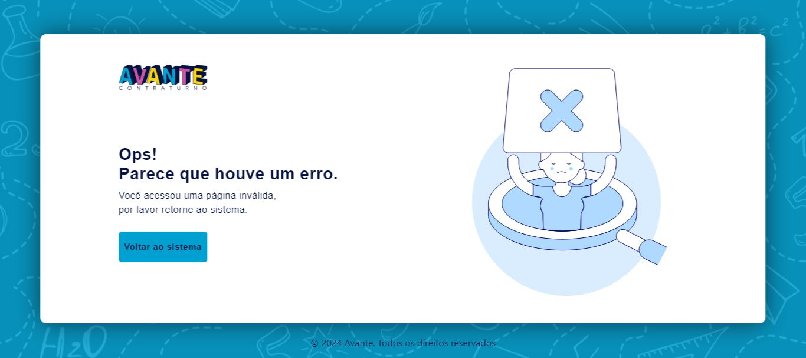

# Introdução 
Esse é um sistema de gerenciamento de atividade, com ele o projeto social avante poderar criar login de acesso, esses login podem criar atividades do tipo Serviços e Aulas, Cadastrar beneficiados do Avante, e inscrever esses beneficiados em algum serviço ou aula.
  

#### (Telas de Exemplo...)

## Tela de Login

## Tela de lista de Aulas criadas

## Tela de cadastro de Beneficiados

## Tela de Erro

